# 计算机视觉

## 图像检测和图像分类

| 维度         | 图像分类           | 图像检测                   |
| ------------ | ------------------ | -------------------------- |
| 输入         | 一张图像           | 一张图像                   |
| 输出         | 一个类别标签       | 多个（位置 + 类别）        |
| 是否需要定位 | 否                 | 是                         |
| 复杂度       | 相对简单           | 更复杂                     |
| 应用场景     | 图像识别、内容审核 | 自动驾驶、安防监控、机器人 |

- **图像分类（Image Classification）**：
	- 目标：判断整张图像属于哪个类别。
	- 输出：一个类别标签（例如“猫”、“狗”、“汽车”）。
	- 例子：输入一张图片，模型输出“这是一张猫的图片”。
- **图像检测（Object Detection）**：
	- 目标：识别图像中多个物体的位置和类别。
	- 输出：多个边界框（Bounding Box） + 每个框内物体的类别标签。
	- 例子：输入一张街景图，模型输出“左上角有一个行人，中间有一辆汽车，右下角有一个交通标志”。

1. **图像检测包含图像分类**：
	- 图像检测可以看作是“定位 + 分类”的组合任务。
	- 在检测过程中，系统首先要**定位**物体的位置（通过边界框），然后对每个检测到的区域进行**分类**。
	- 因此，**分类是检测的一个子步骤**。检测模型内部通常包含一个分类器来判断每个候选区域属于哪个类别。
2. **共享底层技术**：
	- 两者都依赖于深度学习模型，尤其是卷积神经网络（CNN）或视觉Transformer（ViT）。
	- 许多检测模型（如Faster R-CNN、YOLO、SSD）都使用在分类任务上预训练的骨干网络（如ResNet、MobileNet），说明分类模型可以作为检测模型的基础。
3. **共同的特征提取过程**：
	- 无论是分类还是检测，都需要从图像中提取有意义的特征。早期的卷积层通常负责提取边缘、纹理等低级特征，这些对两者都通用。

## 有监督学习和无监督学习

有监督学习：从给定的有标注的训练数据集中学习出一个函数(模型参数)，当新的数据到来时可以根据这个函数预测结果。

无监督学习：没有标注的训练数据集需要根据样本间的统计规律对样本集进行分析。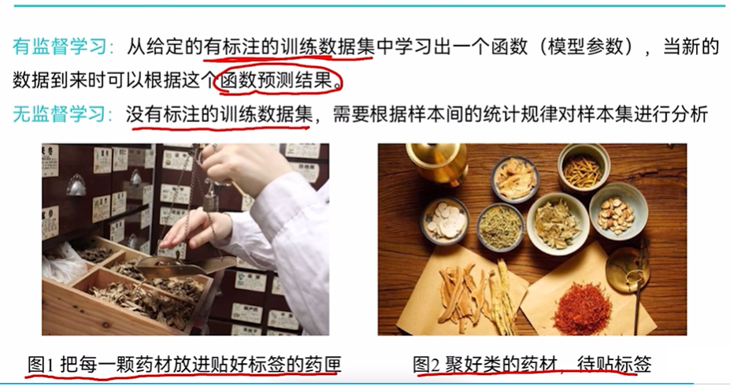


# 噪声

- 高斯噪声 （雪花效果）
- 椒盐噪声 (随机分布的白黑像素)
- 散粒噪声
- 量化噪声


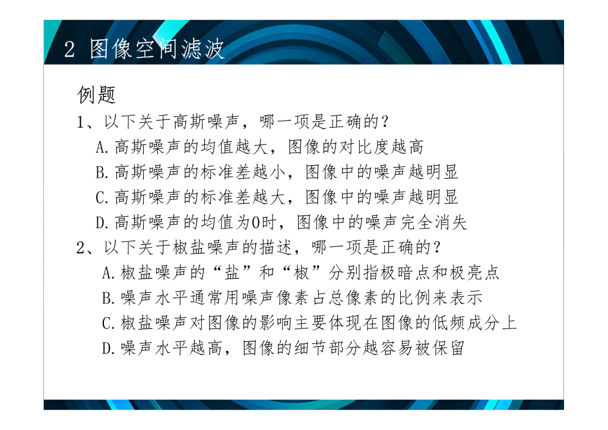

关于高斯噪声的描述，正确选项是 C. 高斯噪声的标准差越大，图像中的噪声越明显。

解释如下：

- **A. 高斯噪声的均值越大，图像的对比度越高**：这是不正确的。高斯噪声的均值（μ）通常表示噪声的中心位置，它并不直接影响图像的对比度。如果均值为0，那么噪声在图像上表现为围绕零点的随机波动；如果均值不为0，则整个图像会有一个整体的偏移，但这并不会增加或减少图像的对比度。

- **B. 高斯噪声的标准差越小，图像中的噪声越明显**：这是错误的。标准差（σ）描述的是噪声的分布范围和强度。标准差越小，意味着噪声的波动范围越小，因此图像中的噪声反而会显得不那么明显。

- **C. 高斯噪声的标准差越大，图像中的噪声越明显**：这是正确的。标准差越大，表示噪声的波动范围越大，噪声对图像的影响也越显著，因此图像中的噪声会更加明显。

- **D. 高斯噪声的均值为0时，图像中的噪声完全消失**：这是不正确的。即使高斯噪声的均值为0，只要标准差不为0，图像中仍然会有噪声存在。均值为0仅仅意味着噪声在图像上的平均影响为0，但并不意味着噪声不存在。

综上所述，正确答案是 C. 高斯噪声的标准差越大，图像中的噪声越明显。

# 平滑

**对像素值调整，降低高频，增强低频**

## 邻域均值滤波

**当前像素点周围领域内的像素平均值来代替当前值**

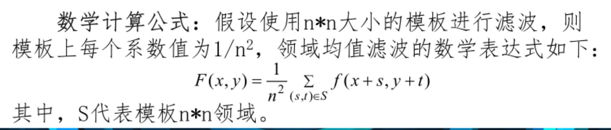

是一种模糊处理，抑制高频，但是损失大量信息

## 加权均值滤波

**对像素及其邻域内的像素赋予不用权重，计算加权平均值**

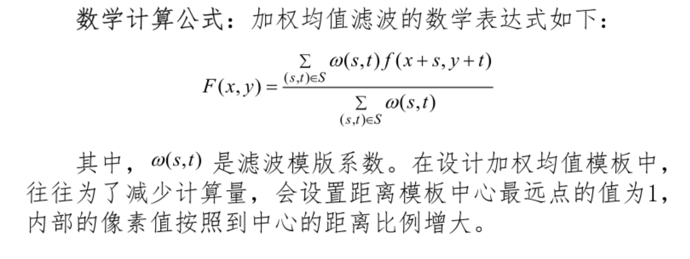

## 高斯均值滤波

**使用高斯权重**


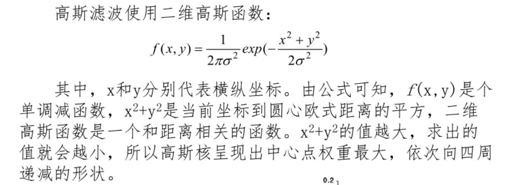

标准差越小数据约聚拢，图像越清晰

非常好的问题！

我们来彻底讲清楚：

> **“标准差 σ 代表什么？它等于卷积核的大小吗？”**

---

## ✅ 简短回答：

> **标准差 σ 不等于卷积核的大小，但它决定了卷积核中权重的“扩散程度”，从而间接影响你该选多大的卷积核。**

---

## ✅ 详细解释：

### 1. 标准差 σ 的含义（在高斯滤波中）

高斯滤波器的核心是**高斯函数**：

\[
G(x, y) = \frac{1}{2\pi\sigma^2} e^{-\frac{x^2 + y^2}{2\sigma^2}}
\]

- **σ 是高斯分布的标准差**，它控制“权重衰减的速度”。
- **σ 越大 → 权重分布越“胖” → 影响范围越广 → 图像越模糊**
- **σ 越小 → 权重集中在中心 → 影响范围小 → 图像越锐利**

👉 **σ 描述的是“模糊的强度”或“平滑的范围”，不是卷积核的物理尺寸。**

---

### 2. 卷积核大小是什么？

卷积核大小是你在程序中实际定义的矩阵尺寸，比如：

- 3×3
- 5×5
- 7×7
- 15×15

这个“大小”是**你手动设定或程序自动选择的计算窗口**。

---

### 3. 那么 σ 和卷积核大小有什么关系？

虽然 σ ≠ 卷积核大小，但它们**密切相关**：

> **卷积核大小应该根据 σ 来选择，以保证能覆盖高斯函数的主要能量区域。**

#### 🎯 经验法则：

通常，卷积核的半径取 **3σ**（即总大小 = 6σ + 1），因为：

- 高斯函数在 ±3σ 范围内包含了约 **99.7% 的能量**
- 超出这个范围的权重几乎可以忽略（< 0.3%）

✅ 所以：

| σ 值    | 推荐卷积核大小（边长） | 说明               |
| ------- | ---------------------- | ------------------ |
| σ = 0.5 | 3×3 或 5×5             | 权重集中，小核足够 |
| σ = 1.0 | 5×5 或 7×7             | 标准去噪           |
| σ = 2.0 | 11×11 或 13×13         | 明显模糊效果       |
| σ = 5.0 | 31×31                  | 强模糊，需大核     |

> ⚠️ 如果你选的核太小（比如 σ=3 却用 5×5 核），会“截断”高斯函数，导致滤波效果失真（边缘振铃、不平滑）。

---

## ✅ 举个例子 🖼️

假设你设置 σ = 2：

- 高斯函数在距离中心 ±6 像素（3σ）处权重已接近 0。
- 所以你应该选至少 **13×13 的卷积核**（从 -6 到 +6，共13个点）。
- 如果你只用 5×5 核，就只计算了中心附近 ±2 像素，丢失了大部分高斯权重 → 滤波效果不准确！

---

## ✅ 在 OpenCV / MATLAB / Python 中如何体现？

```python
import cv2
import numpy as np

# sigma = 2, 自动计算合适核大小
blurred = cv2.GaussianBlur(image, (0, 0), sigmaX=2)

# 或者手动指定核大小，比如 15x15，sigma=2
blurred = cv2.GaussianBlur(image, (15, 15), sigmaX=2)
```

> ✅ 在 OpenCV 中，如果你把核大小设为 `(0,0)`，它会**根据 σ 自动计算合适的核大小**（通常是 `6σ+1`）。

---

## ✅ 总结一句话：

> **标准差 σ 控制“模糊程度”，卷积核大小控制“计算范围” —— 核大小应根据 σ 选择（通常取 6σ+1），以完整覆盖高斯函数的有效区域。**

---

## 📊 附：直观对比图（文字描述）

想象三个高斯曲线：

- σ=0.5：尖锐的山峰 → 3×3 核足够
- σ=1.5：缓坡山丘 → 需要 9×9 核
- σ=3.0：广阔平原 → 需要 19×19 或更大核

核太小 → 像用小碗舀大海，舀不全；  
核太大 → 计算浪费，速度慢，但不影响精度。

---

✅ 理解了这一点，你就能在图像处理中**科学选择 σ 和核大小**，而不是盲目试错！

如有需要，我还可以为你画出不同 σ 对应的高斯核权重热力图 😊

在图像空间滤波中，高斯函数的标准差（σ）直接影响了卷积核中每个位置的权重值。让我们通过具体的例子来理解这一点。

### 1. 高斯函数公式

二维高斯函数公式为：

\[ f(x, y) = \frac{1}{2\pi\sigma^2} \exp\left(-\frac{x^2 + y^2}{2\sigma^2}\right) \]

其中：
- \( x \) 和 \( y \) 是相对于中心点的坐标。
- \( \sigma \) 是标准差，它决定了权重的分布范围和集中程度。

### 2. 计算过程

假设我们选择一个5×5的窗口大小，并将中心点作为坐标原点 (0, 0)，如图所示：

| (-2,-2) | (-1,-2) | (0,-2) | (1,-2) | (2,-2) |
| ------- | ------- | ------ | ------ | ------ |
| (-2,-1) | (-1,-1) | (0,-1) | (1,-1) | (2,-1) |
| (-2,0)  | (-1,0)  | (0,0)  | (1,0)  | (2,0)  |
| (-2,1)  | (-1,1)  | (0,1)  | (1,1)  | (2,1)  |
| (-2,2)  | (-1,2)  | (0,2)  | (1,2)  | (2,2)  |

对于每个坐标点 \((x, y)\)，我们可以计算 \(x^2 + y^2\) 的值，如下表所示：

| 8    | 5    | 4    | 5    | 8    |
| ---- | ---- | ---- | ---- | ---- |
| 5    | 2    | 1    | 2    | 5    |
| 4    | 1    | 0    | 1    | 4    |
| 5    | 2    | 1    | 2    | 5    |
| 8    | 5    | 4    | 5    | 8    |

### 3. 标准差 σ 的体现

现在，我们选择一个具体的 σ 值，比如 σ = 1，然后将每个坐标点带入高斯函数公式中计算权重值。

例如，对于坐标点 \((-2, 2)\)：

\[ f(-2, 2) = \frac{1}{2\pi(1)^2} \exp\left(-\frac{(-2)^2 + 2^2}{2(1)^2}\right) \]
\[ = \frac{1}{2\pi} \exp\left(-\frac{4 + 4}{2}\right) \]
\[ = \frac{1}{2\pi} \exp(-4) \]

类似地，我们可以计算出其他所有坐标点的权重值。

### 4. 权重矩阵

根据计算结果，我们可以得到一个权重矩阵，这个矩阵就是我们的高斯滤波器。权重矩阵中的值反映了每个像素对中心像素的影响程度。

### 5. 不同 σ 值的影响

- **σ 较小**：权重集中在中心附近，远离中心的权重迅速减小，滤波效果较弱，图像细节保留较多。
- **σ 较大**：权重分布更广，远离中心的权重也较大，滤波效果较强，图像变得模糊。

### 总结

标准差 σ 在高斯滤波中的体现是通过影响权重矩阵中的值来实现的。不同的 σ 值会导致不同的权重分布，从而影响滤波效果。具体计算时，需要将每个坐标点带入高斯函数公式中，根据 σ 的值计算出对应的权重值。


非常好的问题！我们来一步一步、手把手地讲清楚：

> **“这个卷积核和图像怎么计算？”**

我们以 **高斯滤波** 为例，假设你已经有一个高斯卷积核（比如 3×3 或 5×5），现在要把它应用到图像上 —— 这就是“卷积计算”。

---

## ✅ 一、卷积计算的本质（一句话）

> **把卷积核“滑动”到图像的每一个像素位置，做“对应位置相乘再求和”，结果作为该位置的新像素值。**

---

## ✅ 二、举个具体例子（手算演示）

我们用一个 **3×3 高斯核** 和一个 **5×5 小图像** 来演示。

---

### 🧩 Step 1：准备数据

#### 图像（5×5，灰度值）：

```
[100, 120, 130, 140, 150]
[110, 125, 135, 145, 155]
[120, 130, 140, 150, 160]
[130, 140, 150, 160, 170]
[140, 150, 160, 170, 180]
```

#### 高斯卷积核（3×3，已归一化）：

```
[0.075, 0.124, 0.075]
[0.124, 0.204, 0.124]
[0.075, 0.124, 0.075]
```

> 💡 注：这个核是 σ=0.8 的高斯核，总和=1（归一化），保证图像亮度不变。

---

### 🧩 Step 2：从图像左上角开始，取 3×3 区域

我们从位置 (1,1) 开始（即第2行第2列，中心像素是125），因为边缘需要填充或跳过 —— 我们这里先**跳过边缘**，只计算能完整覆盖的位置。

所以第一个计算位置是：

```
图像块：
[100, 120, 130]
[110, 125, 135]
[120, 130, 140]
```

---

### 🧩 Step 3：对应位置相乘，再求和

把卷积核和图像块对齐，逐元素相乘后相加：

```
(0.075 × 100) =  7.5
(0.124 × 120) = 14.88
(0.075 × 130) =  9.75

(0.124 × 110) = 13.64
(0.204 × 125) = 25.5
(0.124 × 135) = 16.74

(0.075 × 120) =  9.0
(0.124 × 130) = 16.12
(0.075 × 140) = 10.5
```

👉 **求和**：

7.5 + 14.88 + 9.75 + 13.64 + 25.5 + 16.74 + 9.0 + 16.12 + 10.5 = **123.63**

→ 所以，输出图像中位置 (1,1) 的新值 = **124**（四舍五入取整）

---

### 🧩 Step 4：滑动窗口，重复计算

向右滑动一格，计算位置 (1,2)：

图像块：

```
[120, 130, 140]
[125, 135, 145]
[130, 140, 150]
```

同样做乘 + 加 → 得到新值，比如 134.2 → 134

继续滑动，直到当前行结束，再换下一行…

---

### 🧩 Step 5：边缘怎么处理？

上面我们跳过了边缘（第0行、第4行、第0列、第4列），实际中常用以下方法：

- **Zero Padding（补零）**：在图像四周补一圈0
- **Replicate（复制边缘）**：边缘像素向外复制
- **Reflect（镜像）**：镜像翻转边缘像素
- **Valid（不计算边缘）**：输出图像比原图小（如5×5 → 3×3）

👉 OpenCV 默认用的是 **Reflect**。

---

## ✅ 三、可视化图解（文字版）

想象卷积核像一个“放大镜”，在图像上从左到右、从上到下滑动：

```
第1步：
[■ ■ ■]   [0.075 0.124 0.075]
[■ ■ ■] × [0.124 0.204 0.124] → 输出中心像素值
[■ ■ ■]   [0.075 0.124 0.075]

第2步：
  [■ ■ ■]
  [■ ■ ■] → 向右滑动一格
  [■ ■ ■]

...
```

---

## ✅ 四、用 Python + OpenCV 自动计算（代码演示）

你不需要手算！用代码一行搞定：

```python
import cv2
import numpy as np

# 创建测试图像
image = np.array([
    [100, 120, 130, 140, 150],
    [110, 125, 135, 145, 155],
    [120, 130, 140, 150, 160],
    [130, 140, 150, 160, 170],
    [140, 150, 160, 170, 180]
], dtype=np.float32)

# 高斯模糊（sigma=0.8, 自动选核大小）
blurred = cv2.GaussianBlur(image, (3, 3), sigmaX=0.8)

print("原图：")
print(image)
print("\n高斯滤波后：")
print(blurred.round())  # 四舍五入方便观察
```

输出结果（近似）：

```
原图：
[[100. 120. 130. 140. 150.]
 [110. 125. 135. 145. 155.]
 [120. 130. 140. 150. 160.]
 [130. 140. 150. 160. 170.]
 [140. 150. 160. 170. 180.]]

高斯滤波后：
[[100. 120. 130. 140. 150.]
 [110. 124. 134. 144. 155.]
 [120. 130. 140. 150. 160.]
 [130. 140. 150. 160. 170.]
 [140. 150. 160. 170. 180.]]
```

👉 你看，位置 (1,1) 原来是 125，现在是 124 —— 和我们手算的 123.63 ≈ 124 一致！

---

## ✅ 五、总结（一句话 + 公式）

> **卷积 = 卷积核在图像上滑动，每个位置做“点乘 + 求和”**

数学公式：

\[
(I * K)(i, j) = \sum_{m=-a}^{a} \sum_{n=-b}^{b} I(i+m, j+n) \cdot K(m, n)
\]

其中：
- \( I \) 是输入图像
- \( K \) 是卷积核（大小 (2a+1) × (2b+1)）
- \( (i,j) \) 是当前计算的中心位置

---

## ✅ 六、为什么叫“卷积”？（Bonus）

虽然我们叫它“卷积”，但在图像处理中其实是“互相关（cross-correlation）”，因为没有翻转核。但在滤波器对称时（如高斯核），卷积 = 互相关，所以大家习惯叫“卷积”。

---


## 中值滤波

**统计每个目标像素周围领域像素的中值**

适用范围:像素灰度值与周围差异较大的干扰信号(如椒盐噪声)通常在模板内不为中值，因此，中值滤波在消除这类噪声时效果好。
优点:有效减少了因计算均值而带来的模糊效应，能够更好地保留高频的细节纹理信息。

## 双边滤波

定义:是一种对==高斯滤波==进行改进的滤波方法，它能在消除噪声的同时尽可能地保留高频边缘和纹理信息。在高斯均值滤波中，模板上的系数只与位置有关，双边滤波在其基础上加入了衡量像素灰度值相似度的==权重==。这样权值不仅与距离有关，也与像==素灰度值的相似度==有关，滤波器包括==空间域核==和==值域核==。

# 锐化

**增强图像的边缘信息**

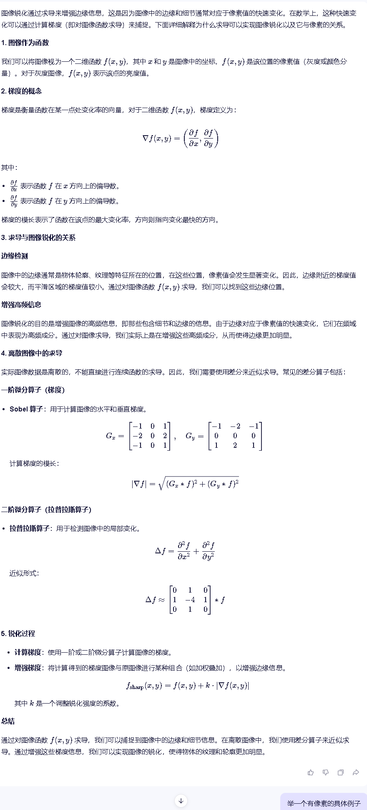


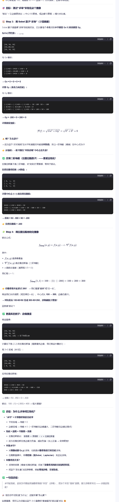


这是一个**非常本质、非常关键的问题**，触及了图像处理的数学基础！

你问：

> **“对于函数 f(x,y)，对应的不是同一个像素值吗？只是单单一个值对吧？如何对 x, y 求偏导？”**

✅ **简短回答：**

> **是的，f(x,y) 在每个 (x,y) 点确实只是一个标量（像素值），但“偏导”不是对“单个值”求的，而是对“像素值在空间上的变化趋势”求的 —— 用“邻域像素”来近似这个变化率。**

---

## ✅ 一、函数 f(x,y) 是什么？

在图像中：

- \( f(x, y) \) 表示在坐标 (x, y) 处的**像素亮度值**（灰度图）或某个颜色通道值（RGB图）。
- 例如：f(0,0) = 50, f(0,1) = 60, f(1,0) = 55, ... → 每个点确实是一个值。

📌 **但！图像不是孤立的点，而是一个“场”（field）** —— 像素在空间上是**连续排列**的（即使离散），所以我们可以研究“像素值如何随位置变化”。

---

## ✅ 二、偏导数的本质：变化率！

偏导数 \( \frac{\partial f}{\partial x} \) 的定义是：

\[
\frac{\partial f}{\partial x} = \lim_{h \to 0} \frac{f(x+h, y) - f(x, y)}{h}
\]

👉 **它衡量的是：当 x 变化一点点时，f 的变化速度。**

但在**离散图像**中：

- 没有“无穷小 h”，最小步长是 1 个像素。
- 不能直接求极限，只能用**差分**来近似导数！

---

## ✅ 三、离散图像中如何“求偏导”？—— 用“差分”近似！

### 1. 前向差分（Forward Difference）：

\[
\frac{\partial f}{\partial x} \approx f(x+1, y) - f(x, y)
\]

→ 用右边像素减去当前像素。

### 2. 后向差分（Backward Difference）：

\[
\frac{\partial f}{\partial x} \approx f(x, y) - f(x-1, y)
\]

→ 用当前像素减去左边像素。

### 3. 中心差分（Central Difference）—— **最常用！**

\[
\frac{\partial f}{\partial x} \approx \frac{f(x+1, y) - f(x-1, y)}{2}
\]

→ 用右边像素减去左边像素，再除以2（步长）。

👉 **这就是 Sobel、Prewitt 等算子的核心思想！**

---

## ✅ 四、举个具体例子！

假设局部图像：

```
f(x-1, y) = 50
f(x,   y) = 100  ← 当前像素
f(x+1, y) = 150
```

### 计算 \( \frac{\partial f}{\partial x} \)：

用中心差分：

$$
\[
\frac{\partial f}{\partial x} \approx \frac{150 - 50}{2} = 50
\]
$$
→ **x方向变化率 = 50**（从左到右，每像素增加50亮度）

### 如果是：

```
f(x-1, y) = 150
f(x,   y) = 100
f(x+1, y) = 50
```

→ 
$$
\( \frac{\partial f}{\partial x} \approx \frac{50 - 150}{2} = -50 \)
$$
→ **负值表示“从左到右变暗”**

---

## ✅ 五、Sobel 算子是怎么做的？

Sobel-x 核：

```
[ -1, 0, 1 ]
[ -2, 0, 2 ]
[ -1, 0, 1 ]
```

👉 **本质就是“中心差分” + “垂直方向平滑”**

- 对每一行：右边 - 左边 → [-1, 0, 1]
- 中间行权重更大（-2, 0, 2）→ 因为更靠近当前像素，更可靠
- 上下两行也参与 → 相当于在 y 方向做了 [1, 2, 1] 的加权平均（抗噪）

所以，Sobel 不是“对单个像素求导”，而是：

> **用当前像素周围的邻域像素，通过加权差分，来估计该点的偏导数！**

---

## ✅ 六、为什么可以这样近似？

因为：

1. **图像在局部是“平滑”的**（除了边缘），像素值不会剧烈跳跃（噪声除外）。
2. **泰勒展开**告诉我们，函数在局部可以用线性（一阶）或二次（二阶）近似。
3. **差分是导数的一阶近似**，在步长 h=1 时，误差是 O(h²)，足够用于图像处理。

---

## ✅ 七、可视化理解

想象你站在一个山丘上（像素值=海拔）：

- 你脚下的海拔是一个值（比如100米）。
- 但你想知道“山坡的坡度”（导数）→ 你得看**前后左右的海拔**！
- 如果东边是150米，西边是50米 → 你脚下的“东向坡度” ≈ (150-50)/2 = 50 米/步。

👉 **导数不是“点”的属性，而是“点附近变化趋势”的属性！**

---

## ✅ 八、总结：回答你的问题

### Q: “f(x,y) 对应的不是同一个像素值吗？只是单单一个值对吧？”

✅ **是的，每个 (x,y) 对应一个像素值，但偏导数不是只靠这个值算出来的 —— 它依赖邻域像素！**

### Q: “如何对 x, y 求偏导？”

✅ **用“差分”近似：**

\( 
$$
\frac{\partial f}{\partial x} \approx \frac{f(x+1,y) - f(x-1,y)}{2}
$$
 \) （中心差分）

\( 
$$
\frac{\partial f}{\partial y} \approx \frac{f(x,y+1) - f(x,y-1)}{2}
$$
 \)

✅ **Sobel、Prewitt 等算子，就是这种差分的“加权版本”，用于抗噪和增强效果。**

---

## ✅ 终极一句话：

> **单个像素只是一个值，但“导数”是通过“比较它和邻居的值”来计算的 —— 这就是图像处理中“局部操作”的精髓！**

---

🎉 现在你彻底理解了：为什么“一个像素值”也能求导！

如果需要，我可以为你画出“差分 vs 导数”的示意图，或者写代码演示不同差分方法的效果 😊


# 三：图像特征提取

## 边缘检测

**边缘**：**灰度剧烈变化的像素点，相当于导数特别大**

### 朴素

在X，Y求偏导

但是因为像素离散，所以用相邻差值代替导数

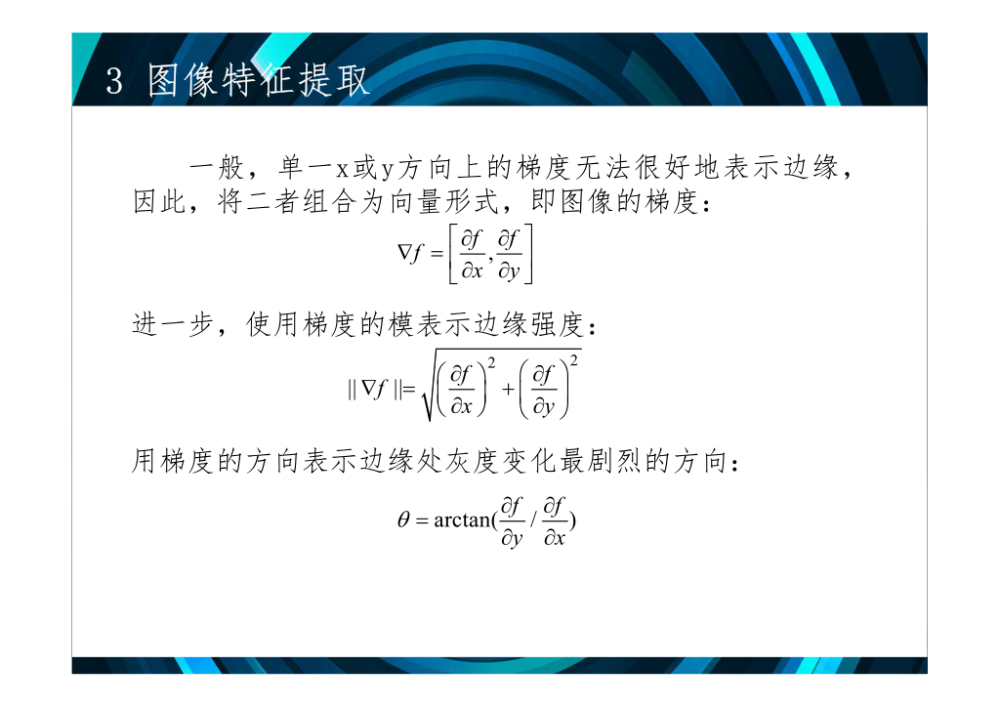

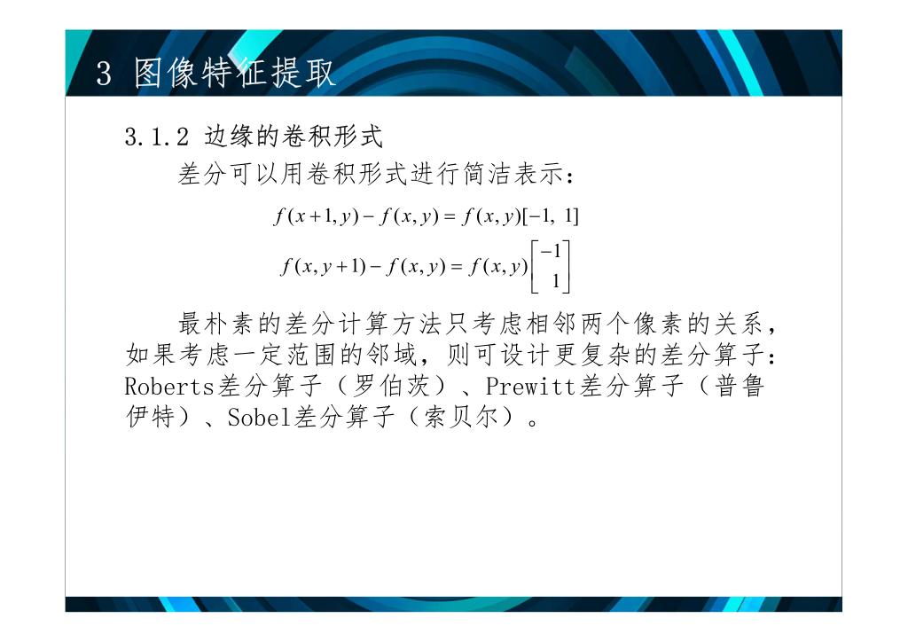

## Roberts（交叉微分算法）

-   基于局部差分的计算
-   

-   **对边缘接近45°效果好**
-   **对噪声敏感，定位不准，边缘粗**

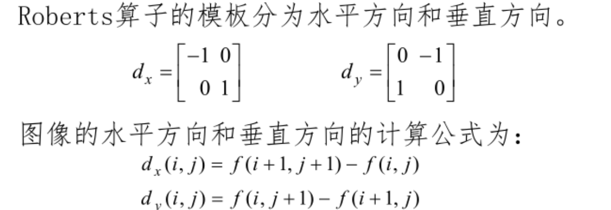

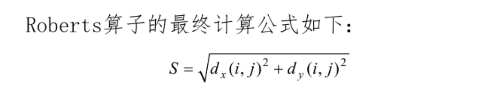


## Prewitt算子

-   **计算水平和垂直方向**
-   **适用于噪声多，灰度渐变的图像**

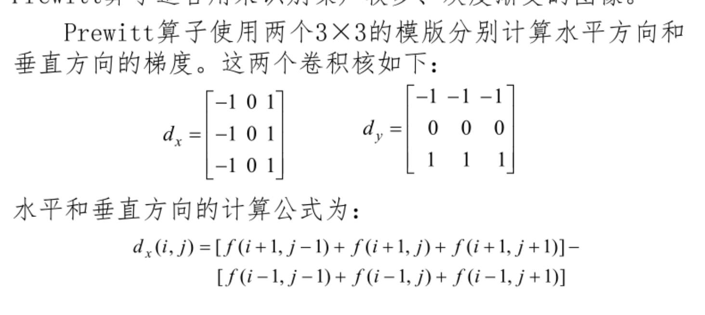

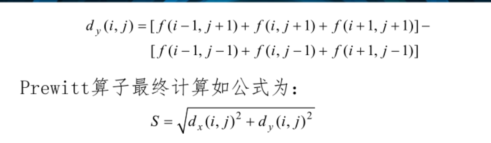


## Sobel

-   高斯平滑 微分求导

-   **引入权重机制优化边缘检测**
    -   距离越近的像素影响大权重大

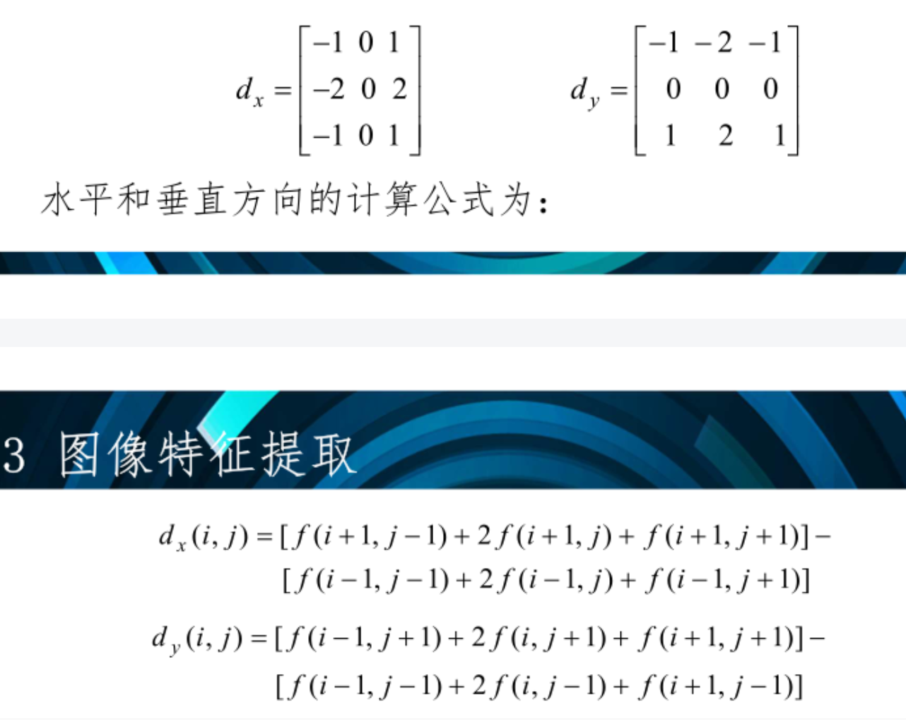


## Candy边缘检测

-   对图像进行高斯滤波平滑处理
    -   噪声集中再高频，容易识别为伪边缘
    -   高斯卷积核大小对性能有影响，尺寸越大对噪声敏感度越低
-   计算梯度

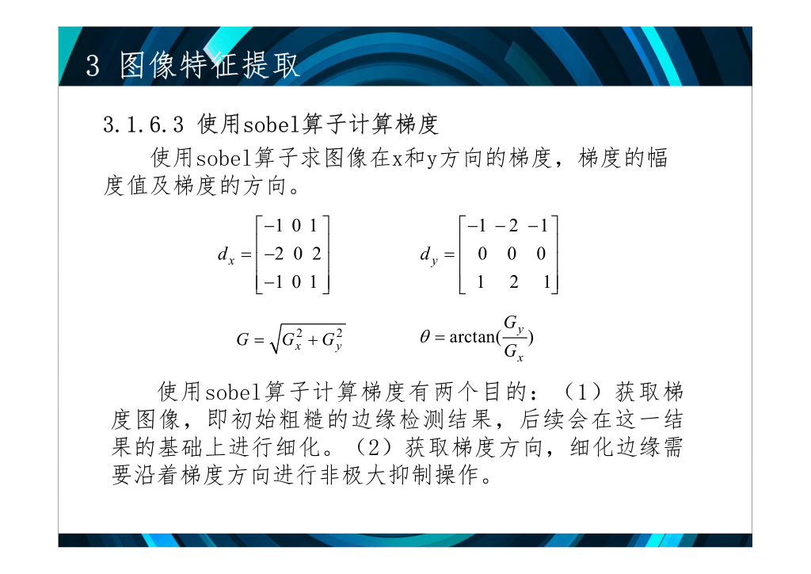

-   梯度的非极大值抑制
    -   **保留最大像素，其他像素置0，梯度在边界处变细**
-   滞后阈值

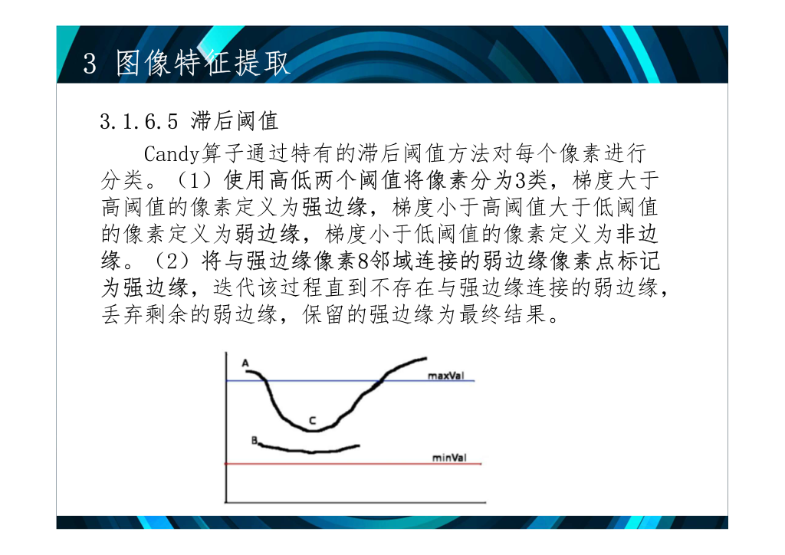


# 角点检测

## 关键点

**角，角点**：**两条边缘的交点被被定义为一个角**

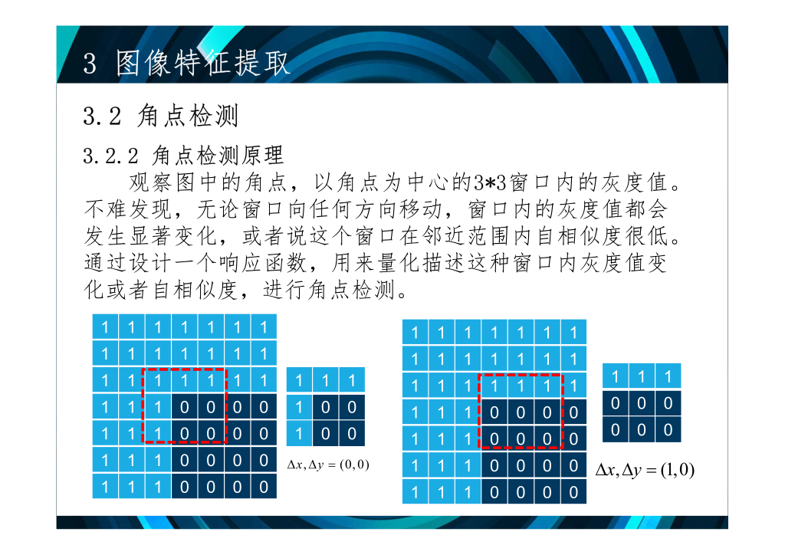


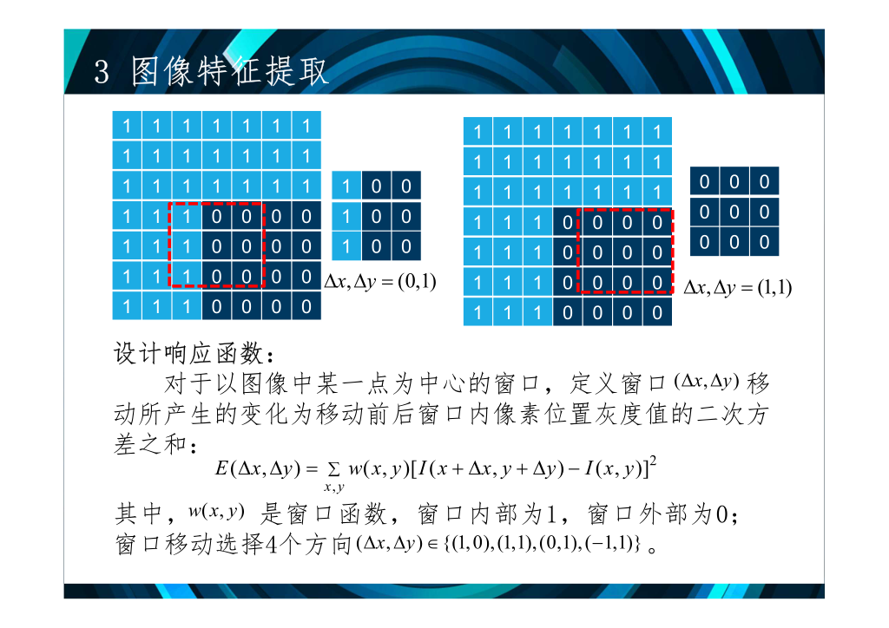

**E**

让我们通过一个具体的例子来理解这个公式 \( E(\Delta x, \Delta y) = \sum_{x,y} w(x,y)[I(x+\Delta x, y+\Delta y) - I(x,y)]^2 \) 的计算过程。

### 示例图像和窗口

假设我们有一个简单的 5x5 图像，其中每个像素的灰度值如下：

```
1 1 1 1 1
1 1 1 1 1
1 1 0 0 0
1 1 0 0 0
1 1 0 0 0
```

我们选择图像中的一个点 (3, 3)（即右下角的 0）作为中心，并使用一个 3x3 的窗口。窗口内部的权重 \( w(x, y) \) 为 1，外部为 0。

### 计算 \( E(\Delta x, \Delta y) \)

#### 1. 当 \( (\Delta x, \Delta y) = (0, 1) \)

这意味着我们将窗口向下移动一行。

- **原窗口**：
  ```
  1 1 0
  1 0 0
  1 0 0
  ```

- **移动后的窗口**：
  ```
  1 0 0
  1 0 0
  1 0 0
  ```

- **计算 \( E(0, 1) \)**：
  \[
  E(0, 1) = \sum_{x,y} w(x,y)[I(x+0, y+1) - I(x,y)]^2
  \]

  对于窗口内的每个像素点 (x, y)，计算其灰度值变化的平方和：

  - (0, 0): \( [0 - 1]^2 = 1 \)
  - (0, 1): \( [0 - 1]^2 = 1 \)
  - (0, 2): \( [0 - 0]^2 = 0 \)
  - (1, 0): \( [0 - 1]^2 = 1 \)
  - (1, 1): \( [0 - 0]^2 = 0 \)
  - (1, 2): \( [0 - 0]^2 = 0 \)
  - (2, 0): \( [0 - 1]^2 = 1 \)
  - (2, 1): \( [0 - 0]^2 = 0 \)
  - (2, 2): \( [0 - 0]^2 = 0 \)

  将这些值相加得到 \( E(0, 1) \)：
  \[
  E(0, 1) = 1 + 1 + 0 + 1 + 0 + 0 + 1 + 0 + 0 = 4
  \]

#### 2. 当 \( (\Delta x, \Delta y) = (1, 1) \)

这意味着我们将窗口向右下角移动一格。

- **原窗口**：
  ```
  1 1 0
  1 0 0
  1 0 0
  ```

- **移动后的窗口**：
  ```
  1 0 0
  1 0 0
  0 0 0
  ```

- **计算 \( E(1, 1) \)**：
  $$
  E(1, 1) = \sum_{x,y} w(x,y)[I(x+1, y+1) - I(x,y)]^2
  $$
  
  
  对于窗口内的每个像素点 (x, y)，计算其灰度值变化的平方和：
  
  - (0, 0): \( [0 - 1]^2 = 1 \)
  - (0, 1): \( [0 - 1]^2 = 1 \)
  - (0, 2): \( [0 - 0]^2 = 0 \)
  - (1, 0): \( [0 - 1]^2 = 1 \)
  - (1, 1): \( [0 - 0]^2 = 0 \)
  - (1, 2): \( [0 - 0]^2 = 0 \)
  - (2, 0): \( [0 - 1]^2 = 1 \)
  - (2, 1): \( [0 - 0]^2 = 0 \)
  - (2, 2): \( [0 - 0]^2 = 0 \)
  
  将这些值相加得到 \( E(1, 1) \)：
  $$
  E(1, 1) = 1 + 1 + 0 + 1 + 0 + 0 + 1 + 0 + 0 = 4
  $$
  

### 总结

通过上述计算，我们可以看到对于不同的 \( (\Delta x, \Delta y) \)，能量函数 \( E(\Delta x, \Delta y) \) 的值是不同的。在实际应用中，我们需要对所有可能的方向进行计算，并选择最小的能量值作为该点的角点响应值。在这个例子中，\( E(0, 1) \) 和 \( E(1, 1) \) 都等于 4，但实际情况中可能会有不同的结果。

-   **取最小E 为角点中心的角点响应**

    -   通过这种方式，可以更准确地反映像素点是否是一个潜在的角点。如果一个像素点在多个方向上都表现出较大的变化，则它很可能是图像中的一个角点。

-   ### **得到阈值化响应结束后，设置角点响应阈值**

    -   通过设置阈值，可以去除那些响应值较小、不太可能是角点的像素点，从而减少误检和漏检的情况。

-   ### **进行非极大抑制处理，即得到角点检测结果**（去除所有小的）

    -   通过非极大抑制，可以确保每个角点都是其邻域内的局部最大值，从而避免重复检测同一个角点，并且能够更精确地定位角点的位置。


## Harris角点检测

改进点:使用高斯窗口函数代替二值化窗口函数;直接对像素求偏导。

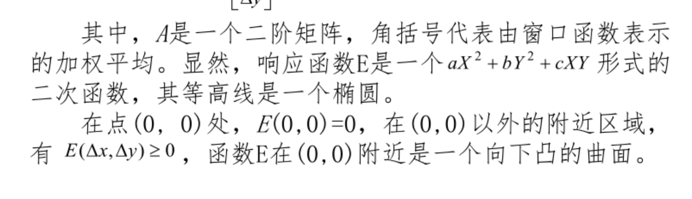

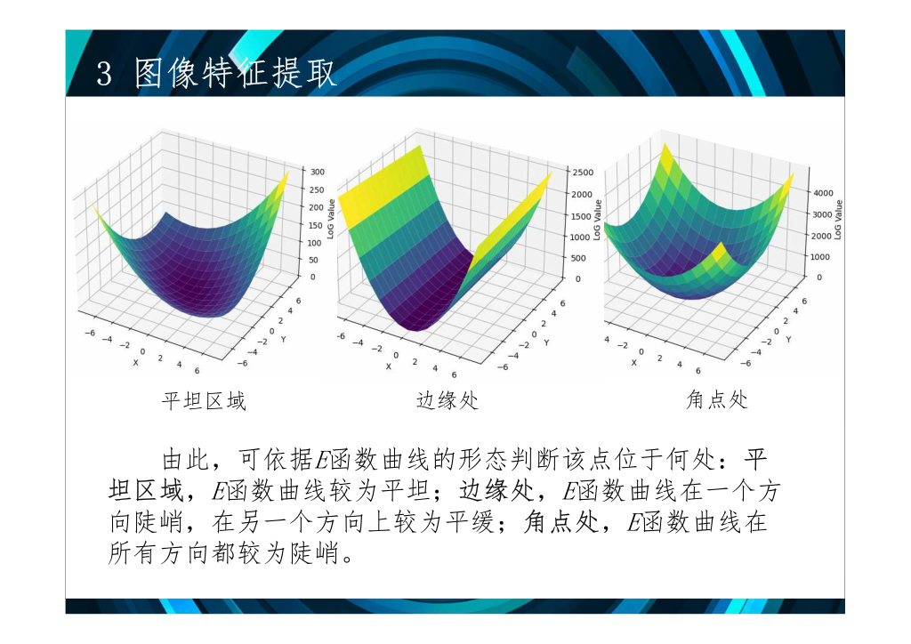

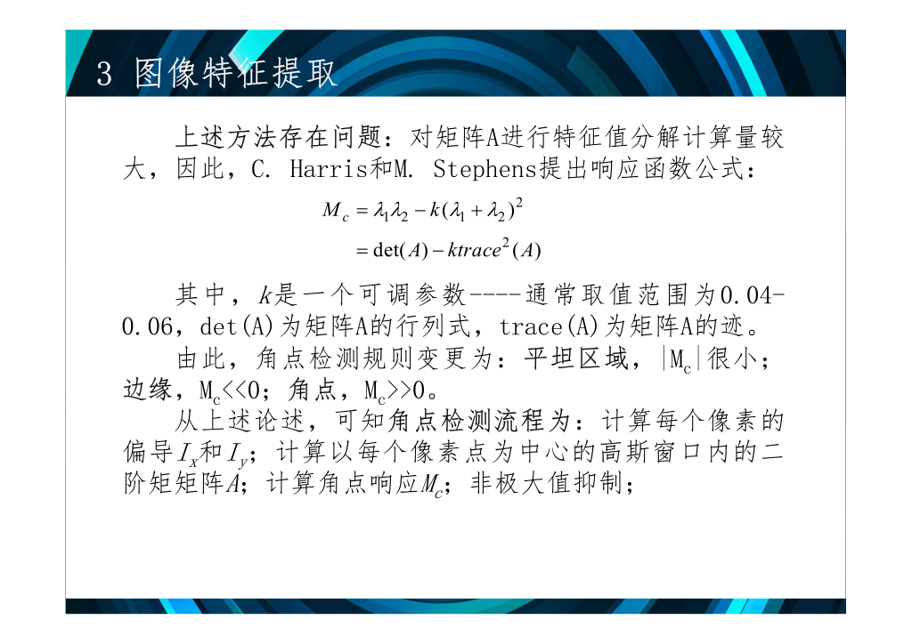

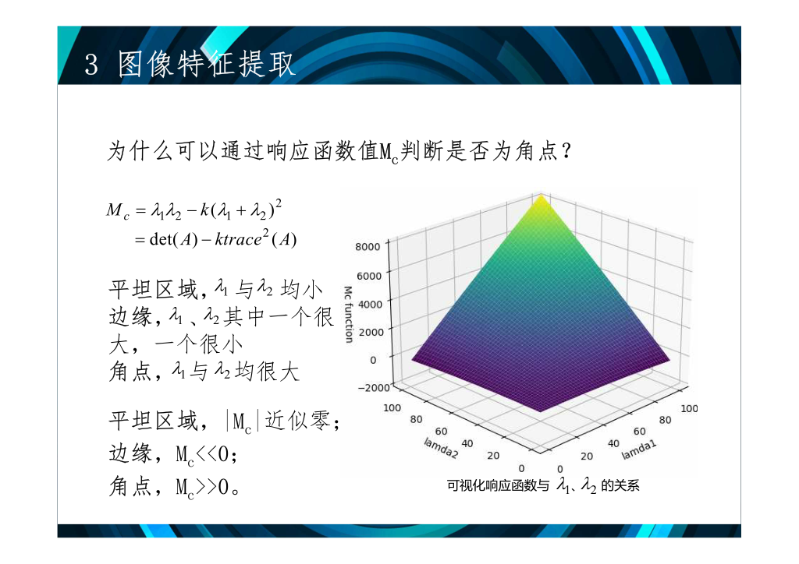


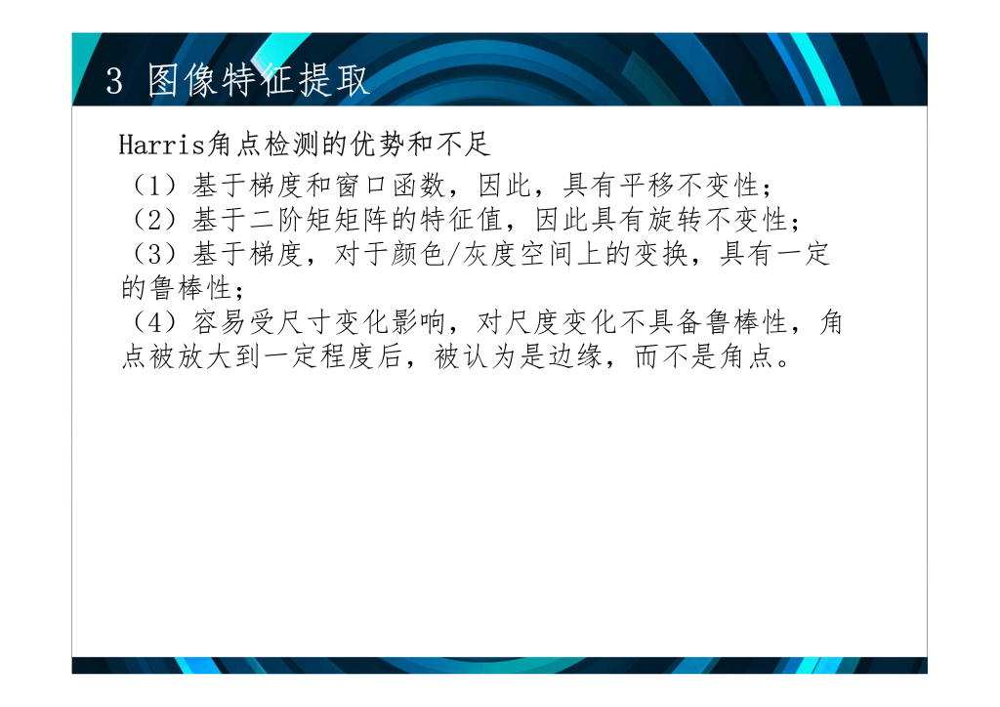


