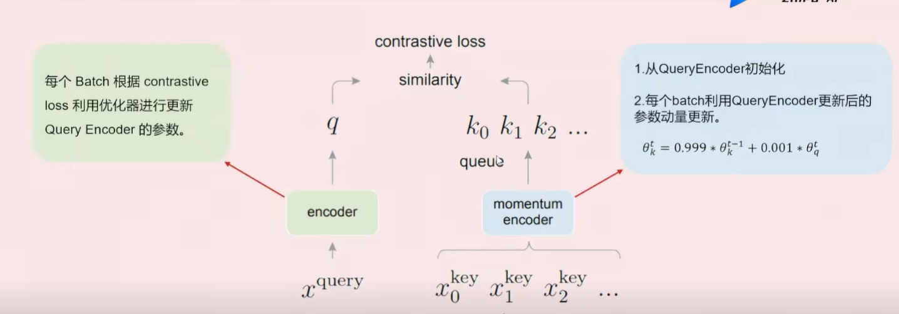

# MOCO

# 要解决的问题

在对比学习和监督学习中，监督学习的模型拥有固定的答案，例如目标检测标签是一定的，也就是要学习的东西是有明确答案的。在对比学习中，对比的两个模型向量完全是由模型自己生成的----

学习的目标在不停的移动，在不同的batch中，模型的移动总是不确定的

-   负样本不够多，那么第二个batch已经忘记了上一个batch，然后模型移动的时候，可能会把不相关的放在一起
-   使用内存，维护一个对列，对列存的都是很多的batch的向量（旧模型），训练新模型不相关

# 要求

-   负例尽可能多
-   负例尽可能一致

# 方法（网络）

EMA 指数移动平均 ： 模型的更新受上次的模型影响大

模型把训练看成了字典模型

-   K 真正参与训练的，变化大的，把这个样本正确选择出与之相对应的数据增强的样本（图文匹配）
-   Q 存几次负样本和一个正样本（数据增强过后的） 

因为维护一个对列，当超过manlen时，模型开始有序的出队和入队保证负例一致

最后使用EMA指数移动平均做损失函数

-   Query 和 key 通常都是图片信息，
-   Query是当前batch中的
-   Key是之前在维护中的对列中的特征的正样本

