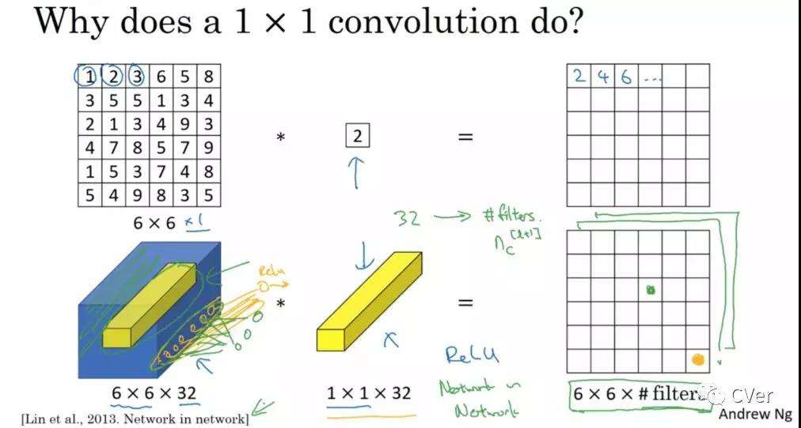

# 1*1的卷积

==等价于该像素点与前一层特征图的所有通道同位置点进行全连接计算==

1x1卷积的核心作用是**改变特征图的通道数**，而不是空间尺寸（宽度和高度）。当你在卷积操作中使用1x1的卷积核时，它的作用是“压缩”或“扩展”特征图的通道维度。

在卷积神经网络中，输入的特征图通常是一个四维张量，形状为 `(batch_size, channels, height, width)`。这个四维张量的各个维度代表：

-   **batch_size**：每批次的样本数量
-   **channels**：通道数（例如RGB图像有3个通道）
-   **height** 和 **width**：特征图的空间尺寸

对于1x1卷积，虽然卷积核大小是1x1，但它会对输入的每一个像素位置应用一个**权重矩阵**，然后通过该权重矩阵来**改变通道数**，而不会影响空间尺寸（高度和宽度）。因此，1x1卷积的效果通常是：

-   **改变通道数**（即输出的通道数）
-   **空间尺寸不变**（即输入的`height`和`width`不变）

### 举个例子：

假设输入特征图的形状是 `(batch_size, 64, 32, 32)`，即每个样本有64个通道，大小是32x32的特征图。如果我们使用一个1x1卷积核并且指定输出的通道数为128，那么输出特征图的形状将会变成 `(batch_size, 128, 32, 32)`，即通道数变成了128，但空间尺寸（32x32）保持不变。

至于初始化时的四个维度，你指的应该是卷积核的形状，它通常是 `(out_channels, in_channels, kernel_height, kernel_width)`，对于1x1卷积核来说，`kernel_height` 和 `kernel_width` 都是1，而`in_channels`和`out_channels`分别对应输入和输出的通道数。




下图中第二行左起第二幅图像中的黄色立方体即为1x1x32卷积核，而第二行左起第一幅图像中的黄色立方体即是要与1x1x32卷积核进行叠加运算的区域。


## 详细计算

好的，让我们用一个简单的例子详细解释 1x1 卷积是如何计算的。假设我们有一个输入特征图，它的通道数是 3，并且它的空间尺寸是 2x2（即宽度和高度都是 2）。我们将使用一个 1x1 卷积核，目标是将输出通道数增加到 2。

### 输入特征图

假设输入特征图（`input`）的形状是 `(3, 2, 2)`，也就是说它有 3 个通道，且每个通道的空间尺寸是 2x2。我们可以表示为：

```
Input Feature Map (3, 2, 2)：

通道 1:   [[1, 2],
           [3, 4]]

通道 2:   [[5, 6],
           [7, 8]]

通道 3:   [[9, 10],
           [11, 12]]
```

### 卷积核

我们使用一个 1x1 卷积核，它的输出通道数为 2（也就是两个卷积核）。每个卷积核会和输入的 3 个通道进行计算。卷积核的形状是 `(2, 3, 1, 1)`，表示有 2 个输出通道，每个卷积核与 3 个输入通道进行计算，并且每个卷积核的空间尺寸是 1x1。

假设卷积核的权重如下：

```
卷积核 1 (对应输出通道 1)：
[[w11, w12, w13]] = [[0.1, 0.2, 0.3]]

卷积核 2 (对应输出通道 2)：
[[w21, w22, w23]] = [[0.4, 0.5, 0.6]]
```

### 卷积计算

1x1 卷积对于每个位置的计算方法是对每个位置的 3 个通道值进行加权求和。这里，我们不关心空间尺寸，因为我们要对每个位置（即每个像素）都应用卷积。

#### 对于输出通道 1 的计算：

1.  先计算输入特征图的每个位置的加权和：

-   对位置 `(1, 1)`（左上角）：
    -   `output1(1,1) = (0.1 * 1) + (0.2 * 5) + (0.3 * 9) = 0.1 + 1.0 + 2.7 = 3.8`
-   对位置 `(1, 2)`（右上角）：
    -   `output1(1,2) = (0.1 * 2) + (0.2 * 6) + (0.3 * 10) = 0.2 + 1.2 + 3.0 = 4.4`
-   对位置 `(2, 1)`（左下角）：
    -   `output1(2,1) = (0.1 * 3) + (0.2 * 7) + (0.3 * 11) = 0.3 + 1.4 + 3.3 = 5.0`
-   对位置 `(2, 2)`（右下角）：
    -   `output1(2,2) = (0.1 * 4) + (0.2 * 8) + (0.3 * 12) = 0.4 + 1.6 + 3.6 = 5.6`

所以输出通道 1 的结果为：

```
Output Channel 1：
[[3.8, 4.4],
 [5.0, 5.6]]
```

#### 对于输出通道 2 的计算：

-   对位置 `(1, 1)`（左上角）：
    -   `output2(1,1) = (0.4 * 1) + (0.5 * 5) + (0.6 * 9) = 0.4 + 2.5 + 5.4 = 8.3`
-   对位置 `(1, 2)`（右上角）：
    -   `output2(1,2) = (0.4 * 2) + (0.5 * 6) + (0.6 * 10) = 0.8 + 3.0 + 6.0 = 9.8`
-   对位置 `(2, 1)`（左下角）：
    -   `output2(2,1) = (0.4 * 3) + (0.5 * 7) + (0.6 * 11) = 1.2 + 3.5 + 6.6 = 11.3`
-   对位置 `(2, 2)`（右下角）：
    -   `output2(2,2) = (0.4 * 4) + (0.5 * 8) + (0.6 * 12) = 1.6 + 4.0 + 7.2 = 12.8`

所以输出通道 2 的结果为：

```
Output Channel 2：
[[8.3, 9.8],
 [11.3, 12.8]]
```

### 最终输出特征图

最终，输出特征图的形状为 `(2, 2, 2)`，即有 2 个输出通道，每个通道的空间尺寸为 2x2。我们将输出通道 1 和输出通道 2 的结果组合在一起，得到最终的输出特征图：

```
Output Feature Map (2, 2, 2)：

通道 1:   [[3.8, 4.4],
           [5.0, 5.6]]

通道 2:   [[8.3, 9.8],
           [11.3, 12.8]]
```

### 总结：

-   每个输出通道通过对输入的 3 个通道的每个位置进行加权求和来得到值。
-   1x1卷积核的作用是将输入特征图的通道数从 3 扩展到 2，同时保留空间尺寸（2x2）不变。


这个讲的也不错https://zhuanlan.zhihu.com/p/40050371