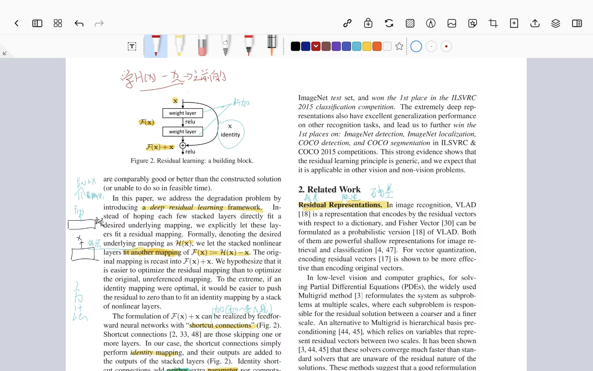
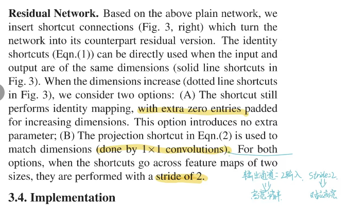
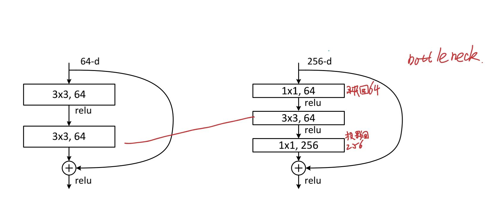

# Residual net

## 问题

-   怎么把网络做的很深？

-   深的网络是简单的堆叠网络吗？

## 之前的解决

-   `normalized initialization 归一化初始化`
    -   `batch normalized`

-   权重做好一点

### 问题

-   可以收敛但是效果不好

### 原因

-   梯度消失或者梯度爆炸

## 残差

`deep residual learning framework`



### 多加一条 `shortcut connections`

-   做了一个`identity mapping`

## 残差连接处理输入和输出不等的情况 

## 为什么要对齐

-   因为你要做F +  x的操作，你输入和输出的维度不同怎么加

### 在输入输出添加一些0


### 加1*1的卷积做投影

在空间上不做变换，但是改变通道数

选择一个卷积，输出通道是输入通道的两倍把残差的输入和输出对应上

输出通道*2 那么高宽会减半

此时使用一个步幅（stride） = 2  使高宽也能对应上



是的，这部分内容的目的是确保 **残差连接**（shortcut connection）中的输入和输出 **维度相同**。具体来说，在输入和输出的 **高宽（空间尺寸）** 或 **通道数** 不一致时，使用 **1x1卷积** 或 **零填充** 来确保维度一致，从而使得残差连接能够正确工作。

### 具体而言：

-   **当输入和输出的高宽一致时**：shortcut连接直接进行 **身份映射**，也就是说，输入直接跳过到输出，不需要改变维度。如果输出通道数需要增加或减少，可以通过 **1x1卷积** 来调整通道数。
-   **当输入和输出的高宽不一致时**：使用以下两种方法：
    1.  **零填充**（Zero Padding）：通过在输入特征图周围填充零，增加特征图的空间尺寸（高宽），使得输入和输出的高宽一致。这样，维度对齐，但通道数保持不变。
    2.  **1x1卷积**（Projection Shortcut）：使用 **1x1卷积** 来调整输入的 **高宽和通道数**，通过设置卷积的 **步长为2** 来实现空间维度的下采样。这样，输入和输出的高宽就会对齐，同时可以调整通道数。

### 为什么要保证维度相同？

1.  **残差连接的要求**：在残差网络中， **输入和输出维度必须相同**，否则无法直接进行相加。如果维度不匹配，无法进行加法操作。为了确保这一点，需要通过上面的方法调整输入和输出的高宽和通道数。
2.  **优化训练**：确保维度一致，使得梯度在反向传播时可以正常流动，避免梯度消失或爆炸的问题，尤其是在非常深的网络中。

### 总结

这部分讲述的目的是确保在维度不一致的情况下，通过 **1x1卷积** 或 **零填充** 的方式，使得 **shortcut路径** 和主路径的输入输出维度一致，从而能够进行有效的残差学习。

---

明白了！你是问如何使用 **残差连接**（shortcut connection）时，输入是 ( 224 \times 224 \times 3 ) 的图片，经过某些操作后，输出的维度应该是什么。

### 残差连接常见的做法

在 **残差网络**（ResNet）中，输入通过主路径进行一系列的卷积操作，然后通过 **shortcut**（跳跃连接）直接加到输出上，确保输入和输出的维度一致，这样才能进行加法操作。

假设你的输入是 **224x224x3**，我们来看一下残差连接中常见的操作：

### 1. **使用步长为2的卷积进行下采样（downsampling）**

通常，网络会在某些层使用 **步长为2的卷积** 来进行下采样，使得输出的 **高宽减半**。

-   **输入**：( 224 \times 224 \times 3 )

-   **卷积操作**：

    -   例如使用一个 **3x3卷积**，步长为2，通道数为64。
    -   这样，输出的 **空间尺寸** 会被 **减半**，而 **通道数** 会发生变化。

    $$
    [
     \text{Height}*{\text{out}} = \frac{\text{Height}*{\text{in}}}{2} = \frac{224}{2} = 112
     ]
    $$

    $$
    [
     \text{Width}*{\text{out}} = \frac{\text{Width}*{\text{in}}}{2} = \frac{224}{2} = 112
     ]
    $$

    

    -   所以输出的空间尺寸是 $( 112 \times 112 )。$
    -   **通道数**：可以设置为64（或者其他任意值，通常在下采样后增加通道数）。

-   **输出**：
    $$
    ( 112 \times 112 \times 64 )
    $$
    

### 2. **如何保证维度一致：shortcut（跳跃连接）**

在使用残差连接时，输入的维度和输出的维度需要相同。如果通过卷积操作后，输出的高宽发生了变化（例如由$ ( 224 \times 224 ) $变为 $( 112 \times 112 )$，则 **shortcut连接** 也需要做相应的调整。通常，这可以通过以下两种方法来实现：

#### a. **使用步长为2的1x1卷积进行下采样**

在 **shortcut路径** 中，使用一个 **步长为2的1x1卷积** 来进行下采样，从而匹配高宽。这样，输入的$ ( 224 \times 224 \times 3 ) $特征图通过1x1卷积后，变成$ ( 112 \times 112 \times 64 )$。

-   **输入**：$( 224 \times 224 \times 3 )$
-   **使用1x1卷积**，步长为2，输出：$( 112 \times 112 \times 64 )$

#### b. **通过零填充来匹配高宽**

如果你不希望通过1x1卷积改变通道数，**零填充**可以用于扩展空间维度（高宽），但通常这在下采样操作中不太常见。

### 总结：

-   如果输入是 $( 224 \times 224 \times 3 )$，经过 **步长为2的卷积**（比如$ ( 3 \times 3 ) $卷积）后，输出的空间维度变为$ ( 112 \times 112 )$，而 **通道数**（channels）通常会增加（比如增加到64、128等）。
-   为了让残差连接有效，**shortcut路径** 也需要调整，通过 **步长为2的1x1卷积** 来确保维度一致。
-   **输入**：$( 224 \times 224 \times 3 )$
-   **经过卷积后**：$( 112 \times 112 \times 64 )$（如果步长为2且通道数为64）

这样就可以在残差连接中进行加法操作了，确保输入和输出的维度一致。


## 降维操作



当你用 `1×1, 256→64` 的卷积时，网络会**自动学习如何从 256 个通道中提取最重要的 64 个组合特征**。

这个操作相当于对每个空间位置（H×W）上的 256 维向量，做一个**线性变换**，映射到 64 维。

✅ 如果这 256 维中有大量冗余，那么一个训练良好的 1×1 卷积可以**保留最关键的语义信息**，丢弃噪声或重复信息。

📌 这不是“粗暴压缩”，而是“智能降维”。


###  3. 后续层会“重建”信息

虽然中间降到 64，但最后又通过另一个 1×1 卷积升回 256：

```
256 → (1×1→64) → (3×3→64) → (1×1→256) → + 残差
```

这个升维过程可以看作是：

>   “我先用 64 个精炼特征提取空间结构（3×3 卷积），然后再扩展回 256 维，去重建更丰富的表示。”

**即使 F(x) 丢失了一些信息，x 仍然完整地保留了原始信息**。


## 残差网络的最后一层  全局平均池化（GAP）

在 **残差网络**（ResNet）的最后，通常会使用 **全局平均池化**（Global Average Pooling, GAP）来代替全连接层（Fully Connected Layer）。虽然它也用于分类任务，**全局平均池化**能够在不需要复杂的全连接层的情况下，有效地进行分类。以下是为什么可以不使用全连接层的几个原因：

### 1. **全局平均池化（GAP）的工作原理**

-   **全局平均池化** 通过对每个特征图（channel）进行 **平均池化**，将每个特征图的高宽尺寸压缩成一个数值。例如，对于一个 $( H \times W \times C )$ 的特征图（其中 ( C ) 是通道数），每个通道通过 **平均池化**（对每个通道进行平均）将 $( H \times W ) $的特征图压缩为一个值。因此，输出的特征向量的大小为 **C**（通道数）。
-   比如，如果输入特征图是 $( 7 \times 7 \times 512 )$（即7x7的空间尺寸和512个通道），通过全局平均池化之后，得到的输出是$ ( 1 \times 1 \times 512 )$，然后将每个通道的平均值提取出来，最终得到一个包含512个元素的向量。

### 2. **为什么可以不使用全连接层**

-   **减少参数数量**：全连接层的参数数量通常非常大，尤其是在深度网络中。对于输入尺寸为$ ( 7 \times 7 \times 512 ) $的特征图，使用全连接层将其展平为一个非常大的向量（例如$ ( 7 \times 7 \times 512 = 25088 ) $个元素），然后进行分类。这会引入大量的学习参数，增加计算量和过拟合的风险。而 **全局平均池化** 会显著减少参数数量，因为它直接将每个通道压缩成一个数字，减少了计算和存储开销。
-   **更好的泛化能力**：全连接层容易导致过拟合，特别是在数据集较小或特征图较大的情况下。而全局平均池化通过 **压缩特征图**，让网络更加简单，降低了模型的复杂性，进而提升了泛化能力。
-   **不依赖空间位置**：全连接层依赖于输入的 **空间结构**，因为它会将特征图展平为一个长向量，而 **全局平均池化** 则通过对每个通道的全局平均来忽略空间位置，只关心每个通道的存在与否。这使得网络对 **空间位置不敏感**，从而获得更高的鲁棒性，适应更多变化的数据。

### 3. **如何用于分类**

-   在分类任务中，通常在全局平均池化之后，网络会连接一个 **softmax层** 来进行分类预测。全局平均池化后的输出是一个长度为 ( C ) 的向量（其中 ( C ) 是类别数），而 **softmax** 层将这个向量转换成每个类别的预测概率。
-   比如，假设在最后一层使用全局平均池化后，我们得到了一个 ( 1 \times 1 \times 512 ) 的特征图。然后，我们将其展平成一个长度为512的向量，并通过一个 **全连接层**（通常为一个 **线性层**）映射到类别数 ( C ) 上。输出的维度为 ( 1 \times C )，然后通过 **softmax** 转换为每个类别的概率。

### 4. **优点**

-   **减少计算和内存开销**：通过 **全局平均池化**，我们避免了展平特征图并通过全连接层进行计算的高昂代价。
-   **简化网络结构**：全局平均池化简化了网络结构，去除了复杂的全连接层，使得模型训练和推理更加高效。
-   **提高泛化能力**：因为不依赖大量的可训练参数，网络更容易在未见过的数据上做出准确预测。

### 总结：

-   **全局平均池化** 不需要展平特征图，也不需要全连接层的庞大参数量。它通过将每个通道的空间特征进行平均，直接输出一个固定长度的向量，极大减少了参数量和计算量。
-   在分类任务中，全局平均池化后的输出直接通过 **线性层** 映射到类别数，并使用 **softmax** 进行预测，达到与传统全连接层相同的分类效果，但计算更加高效，且减少了过拟合的风险。


